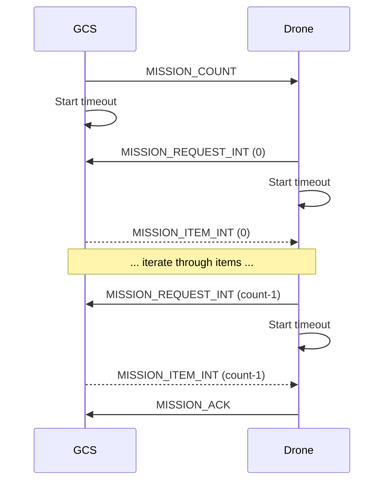
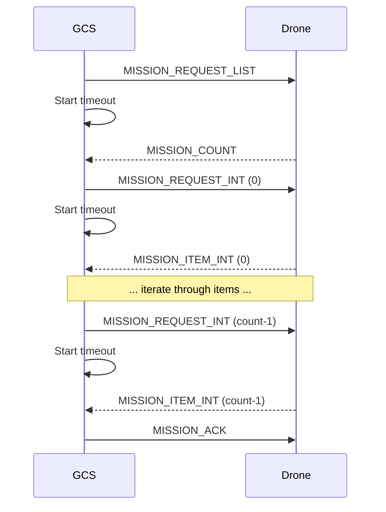

A network protocol for communicating with drones.
- Data streams are sent and received through a **publish-subscribe model**.
- Configuration sub-protocols, like mission protocols are **point-to-point** with **retransmission**.

Messages are defined with [XML files](https://mavlink.io/en/messages/common.html).
- **Dialect**: The message set supported by a MAVLink system.
- A *code generator* generates software libraries from these message definitions, which can then be used by drones and ground stations.

We are using [MAVSDK](./MAVSDK.md) for base station to drone communication.

# MAVLink Network
A MAVLink network is made out of **systems** such as drones, ground stations and so on. Each system may be composed out of one or more *components* (autopilot, camera, servos, etc)
- **System ID**: Uniquely identifies a system. Value is from 1 to 255.
  - Autopilot systems use lower IDs (typically increasing IDs).
  - GCS systems use IDs at the top to reduce ID clashes.
- **Component ID**: Uniquely identifies a component.

Each MAVLink message has a `target_system` and `target_component` that indicates to which system and component the message should be routed to.
- If these IDs are omitted or set to 0, the message is a **broadcast** (for all systems or all components).

# Microservices
MAVLink 'microservices' are high-level protocols so we don't need to mess around with direct MAVLink commands.

## Heartbeat/Connection Protocol
The `HEARTBEAT` message of a system on the MAVLink network indicates that it is **connected** to the network.
- After a given number of missing messages, the system is considered **disconnected**.
- This is broadcast by a component every 1 second, and typically a system is considered disconnected if four or five messages aren't received.
- This heartbeat message also contains various information about the system -- e.g. the type of system, whether autopilot is allowed, and so on.

## Mission Protocol
This allows a GCS or API to exchange mission/flight plan, geofencing and safe point information with a drone or component.

### Operations
(see [this link](https://mavlink.io/en/services/mission.html) for details)

#### GCS Uploading Mission to Drone


#### GCS Downloading Mission from Drone


### Mission Types
#### Flight Plans (`MAV_MISSION_TYPE_MISSION`)
- Navigation/Movement Commands, with `MAV_CMD_NAV_*`.
- Immediate Action Commands (e.g. changing speed or servo activation), with `MAV_CMD_DO_*`.
- Conditional Commands, with `MAV_CMD_CONDITION_*`.

#### Geofence (`MAV_MISSION_TYPE_FENCE`)
Prefixed with `MAV_CMD_NAV_FENCE_`.

#### Rally Point (`MAV_MISSION_TYPE_RALLY`)
Just one such command -- `MAV_CMD_NAV_RALLY_POINT`.

### Mission Plain-Text File Format
This is a de-facto standard for storing mission information.
```
QGC WOK <VERSION>
<INDEX> <CURRENT WP> <COORD FRAME> <COMMAND> <P1> <P2> <P3> <P4> <P5> <P6> <P7> <AUTOCONTINUE>
```
- The first line is the file format, and version information.
- Subsequent lines are **mission items**.
- Note that the spaces are actually `\t` (tabs).

Typically (depending on the mission):
- `P5` is `x` (local frame), or latitude (global frame).
- `P6` is `y` (local frame), or longitude (global frame)
- `P7` is `z` (local frame), or altitude (global frame)
